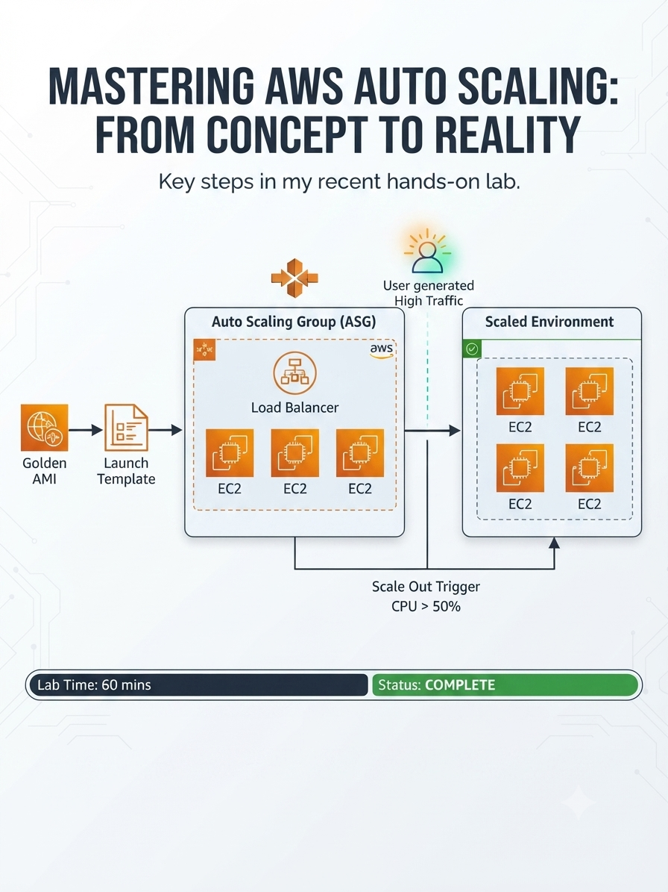

##  AWS Auto Scaling Lab
Configurei um ASG pra escalar sozinho. Ele escalou. E escalou. E escalou. E destruiu tudo em loop.
Depois eu descobri que o Health Check falhava porque as instâncias estavam em subnet privada sem NAT Gateway.

  

https://aws.amazon.com/
https://aws.amazon.com/ec2/
https://aws.amazon.com/cloudwatch/
https://docs.aws.amazon.com/AmazonCloudWatch/latest/logs/
https://aws.amazon.com/sns/
https://aws.amazon.com/eventbridge/
https://aws.amazon.com/config/
https://aws.amazon.com/iam/

## O que é isso

Lab prático de Auto Scaling Group (ASG) com Application Load Balancer (ALB) na AWS. O objetivo era montar uma arquitetura que escala horizontalmente sozinha quando a CPU sobe, e distribui tráfego entre duas Availability Zones.
Região: us-west-2 (AZs: us-west-2a e us-west-2b)
Na teoria: carga sobe → CloudWatch dispara → ASG cria instâncias → ALB distribui → todo mundo feliz.
Na prática: eu passei 20 minutos vendo instâncias nascerem e morrerem sem parar.

Este repositório documenta um laboratório prático focado na implementação de arquiteturas resilientes na AWS usando **Auto Scaling Groups (ASG)** e **Elastic Load Balancing (ELB)**.

## 🏗️ Arquitetura do Projeto
O objetivo foi criar um ambiente capaz de escalar horizontalmente de forma automática com base na utilização de CPU.

- **Frontend/Application:** Servidor web simples.
- **Compute:** Instâncias EC2 gerenciadas por um ASG.
- **Load Balancer:** Distribuição de tráfego entre múltiplas zonas de disponibilidade (us-west-2a e us-west-2b).
- **Automation:** Escalabilidade baseada em política de CPU (> 50%).

## 🚀 Etapas Executadas
1. **Definição de Imagem:** Criação de uma *Golden AMI* para padronização.
2. **Infraestrutura como Código (Conceitual):** Utilização de *Launch Templates* para garantir consistência nas novas instâncias.
3. **Configuração de ASG:** Definição de limites (Min: 2, Max: 4) e políticas de escalonamento.
4. **Stress Test:** Simulação de alta carga para validação da resposta automática do sistema.
5. **Monitoramento:** Observação da transição de estado no CloudWatch e provisionamento automático no EC2.

## 📊 Resultados
O sistema demonstrou capacidade de *Scale-Out* (adição de instâncias) em menos de 5 minutos após a detecção de alta carga, garantindo que a aplicação permanecesse disponível e performática.

---
*Este laboratório faz parte da minha jornada de aprendizado em AWS Cloud Computing.*
