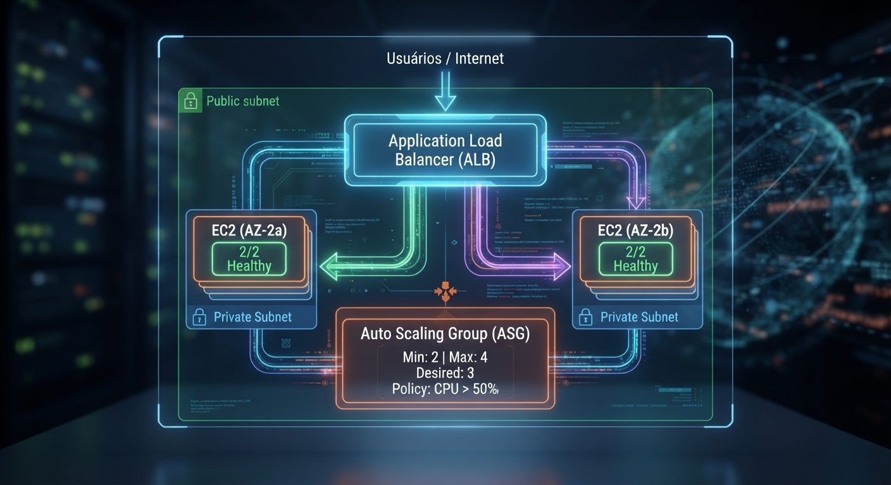

##  AWS Auto Scaling Lab
Configurei um ASG pra escalar sozinho. Ele escalou. E escalou. E escalou. E destruiu tudo em loop.
Depois eu descobri que o Health Check falhava porque as instâncias estavam em subnet privada sem NAT Gateway.

  

https://aws.amazon.com/
https://aws.amazon.com/ec2/
https://aws.amazon.com/cloudwatch/
https://docs.aws.amazon.com/AmazonCloudWatch/latest/logs/
https://aws.amazon.com/sns/
https://aws.amazon.com/eventbridge/
https://aws.amazon.com/config/
https://aws.amazon.com/iam/

## O que é isso

Lab prático de Auto Scaling Group (ASG) com Application Load Balancer (ALB) na AWS. O objetivo era montar uma arquitetura que escala horizontalmente sozinha quando a CPU sobe, e distribui tráfego entre duas Availability Zones.

Região: us-west-2 (AZs: us-west-2a e us-west-2b)
Na teoria: carga sobe → CloudWatch dispara → ASG cria instâncias → ALB distribui → todo mundo feliz.
Na prática: eu passei 20 minutos vendo instâncias nascerem e morrerem sem parar.

Este repositório documenta um laboratório prático focado na implementação de arquiteturas resilientes na AWS usando **Auto Scaling Groups (ASG)** e **Elastic Load Balancing (ELB)**.

## O que eu montei

1. Golden AMI + Launch Template
   
Criei uma AMI padronizada com o servidor web já instalado e configurado.
Usei essa AMI num Launch Template pra garantir que toda instância nova saia do forno igualzinha.

Configurações do template: AMI customizada (Golden AMI)
Tipo: t2.micro
Security Group: HTTP (80) e SSH (22) — SSH restrito ao meu IP
User data: script de bootstrap pra subir o serviço

## 2. O Auto Scaling Group

Configurei o ASG com:
Min: 2 instâncias (uma por AZ)
Max: 4 instâncias
Política de escala: Adiciona 1 instância quando CPU média > 50% por 2 minutos
Health Check: ELB (não EC2)

Distribuí entre as subnets públicas das duas AZs. Ou pelo menos foi o que eu achei que tinha feito.

## O que deu errado (e foi o melhor aprendizado)

Subi o ASG. As duas instâncias iniciais entraram. Fui no ALB... Target Group vazia. Nenhuma instância saudável.
Fui verificar: as instâncias estavam em subnets privadas.
"Mas Eliana, subnets privadas não acessam a internet. E seu servidor web precisa baixar updates? Não. Mas o Health Check do ALB precisa que a instância responda na porta 80. E se a aplicação precisa de algo externo..."
Na verdade, o problema era pior: as instâncias não conseguiam nem responder ao Health Check do ALB corretamente porque o fluxo de retorno tava quebrado. O ASG olhava pro ALB, via que as instâncias estavam unhealthy, e decidía: "vou criar outra".

Pânico por uns 20 minutos. Vi o gráfico do CloudWatch parecendo batimento cardíaco descontrolado.

A correção

Mudei as instâncias para subnets públicas (ou adicionei NAT Gateway + Route Table correta — dependendo do cenário real, aqui no lab foi mover pra pública).
Ajustei o Security Group do ALB pra permitir tráfego da internet na 80.
Ajustei o Security Group das EC2 pra permitir tráfego do ALB na 80.
Health Check passou. O loop parou.

## O stress test

# Instalei o stress
sudo amazon-linux-extras install epel -y
sudo yum install stress -y

# Mandei ver na CPU
sudo stress --cpu 2 --timeout 300
Depois que funcionou, hora de ver se escala mesmo.
Entrei numa das instâncias e rodei:

# Instalei o stress
sudo amazon-linux-extras install epel -y
sudo yum install stress -y

# Mandei ver na CPU
sudo stress --cpu 2 --timeout 300

Fui no CloudWatch e fiquei olhando o gráfico de CPU subir.

Resultado:

CPU passou de 50%
Alarme do CloudWatch disparou
ASG criou a 3ª instância em ~3 minutos
Depois a 4ª
Quando parei o stress, CPU caiu
ASG destruiu as extras em ~5 minutos
Scale-out: < 5 minutos
Scale-in: ~5 minutos

## Evidências

| O que tá acontecendo                           | Print                                |
| ---------------------------------------------- | ------------------------------------ |
| Arquitetura do lab                             | `images/arquitetura-autoscaling.png` |
| CloudWatch: CPU disparando                     | `images/cloudwatch-cpu-alarme.png`   |
| ASG criando instâncias                         | `images/asg-scale-out.png`           |
| Target Group com instâncias saudáveis          | `images/target-group-healthy.png`    |
| Loop de instâncias criadas/destruídas (o erro) | `images/asg-loop-panico.png`         |

## Tech Stack

EC2 — instâncias gerenciadas pelo ASG
Auto Scaling Group (ASG) — escala automática baseada em CPU
Application Load Balancer (ALB) — distribuição de tráfego entre AZs
Launch Template — padronização das instâncias
Golden AMI — imagem customizada com a aplicação
CloudWatch — métricas e alarmes de CPU
VPC / Subnets — isolamento e distribuição (e dor de cabeça)
Security Groups — controle de tráfego

## O que esse lab realmente me ensinou

Subnet importa. Privada vs pública não é só "segurança". Se o ALB não alcança ou o Health Check não volta, seu ASG vira um gatilho automático de destruição.
Health Check é a alma. ASG sem Health Check funcionando é como carro sem freio. Ele acelera, mas não sabe quando parar.
CloudWatch é seu olho. Sem o gráfico de CPU, eu não saberia nem se o stress funcionou. Com ele, eu vi a escalada acontecer em tempo real.
Golden AMI economiza vida. Configurar a instância na mão toda vez? Nunca mais. AMI + Launch Template = consistência.

## 🚧 Status

[x] Lab concluído
[x] Loop de pânico documentado
[x] Stress test realizado e validado
[x] Prints anexados
[ ] Refazer em Terraform (em breve)

## 🌐 Contato
💼 LinkedIn: linkedin.com/in/eliana-diniz
📧 E-mail: eliana.dinizsilva@gmail.com
"Pensei que o difícil seria fazer escalar. O difícil foi fazer parar de matar as instâncias."

